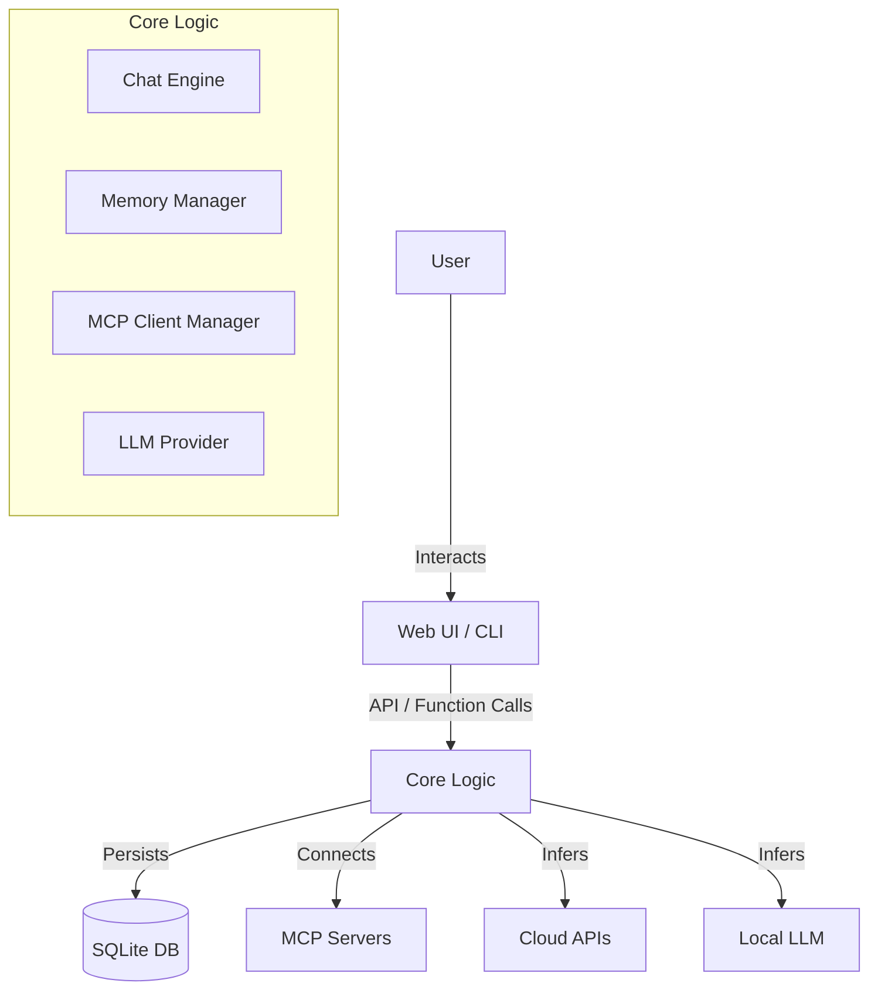

# Architecture

The Robust MCP Client is designed with a modular architecture to support multiple interfaces (CLI, Web UI) and extensible components (LLM Providers, MCP Servers).

## High-Level Overview

## Components

### 1. Core (`core/`)
The heart of the application. It is framework-agnostic and can be used by both the CLI and the FastAPI server.

- **LLM Abstraction (`core/llm/`)**:
  - `BaseLLM`: Abstract base class defining `chat_complete` and `chat_stream`.
  - `LocalLLM`: Wrapper around `llama-cpp-python`. Handles model downloading and inference.
  - `CloudLLM`: Implementations for OpenAI, Gemini, and Anthropic.
- **Memory Manager (`core/memory/`)**:
  - Uses `aiosqlite` to store conversations and messages in a local SQLite database (`history.db`).
- **MCP Client (`core/mcp/`)**:
  - Manages connections to Model Context Protocol (MCP) servers.
  - Currently supports `stdio` transport for local server execution.
- **Chat Engine (`core/chat_engine.py`)**:
  - Orchestrates the flow: User Input -> Memory -> Tool Discovery -> System Prompt Construction -> LLM Inference -> Response Streaming.

### 2. Server (`server/`)
A **FastAPI** application that exposes the Core logic via HTTP/WebSocket (Streaming Response).

- **Endpoints**:
  - `POST /api/chat`: Streaming chat endpoint.
  - `GET /api/history/{id}`: Retrieve conversation history.
  - `POST /api/config`: Update runtime configuration.
- **Static Files**: Serves the built React frontend from `ui/dist`.

### 3. UI (`ui/`)
A **React** Single Page Application (SPA) built with **Vite**.

- **Tech Stack**: React, TailwindCSS, Lucide Icons, React Markdown, Mermaid.
- **Features**:
  - Real-time streaming.
  - Code syntax highlighting.
  - Mermaid diagram rendering.
  - Dark/Light mode.

### 4. CLI (`cli/`)
A terminal-based interface built with **Typer** and **Rich**.

- Provides a direct way to interact with the Chat Engine without a browser.
- Useful for headless environments or quick testing.
